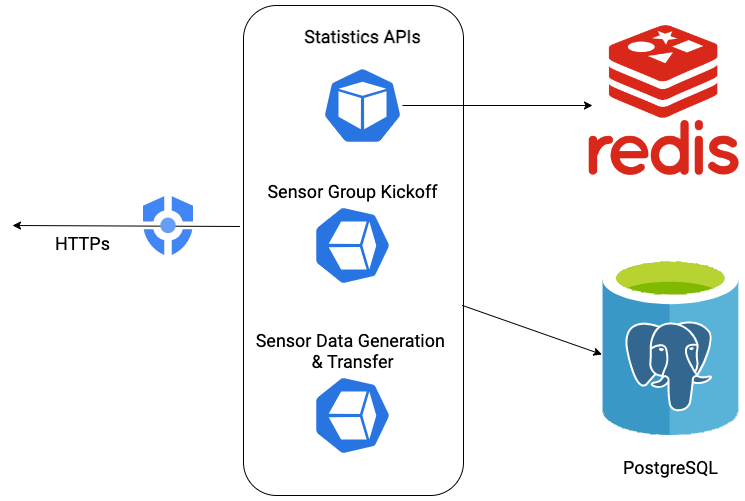
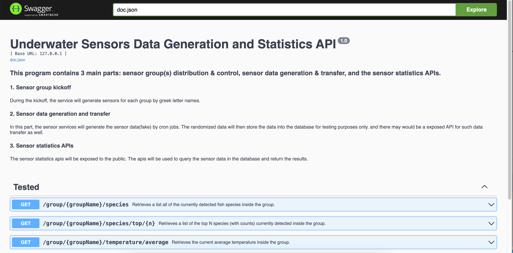
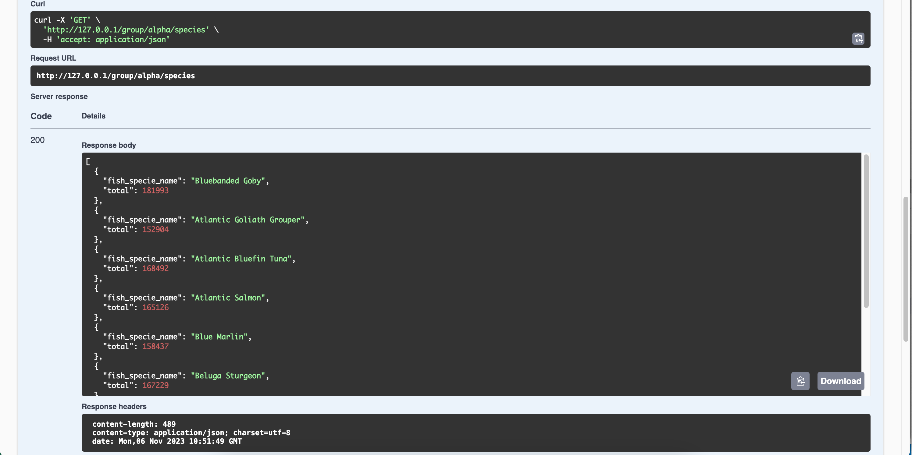
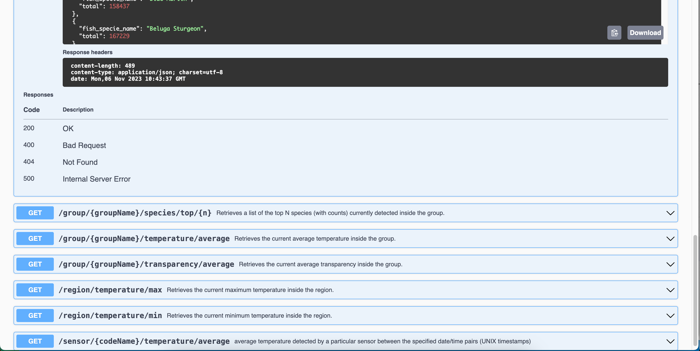

<div align="center">
<h1>Underwater sensors data generation and statistics APIs</h1>
</div>
<br>
<hr>

## Table of contents:

- [Table of contents:](#table-of-contents)
  - [Program Architecture](#program-architecture)
  - [Sensor group kickoff](#sensor-group-kickoff)
  - [Sensor data generation and transfer](#sensor-data-generation-and-transfer)
  - [Sensor statistics APIs](#sensor-statistics-apis)
  - [API Documentation](#api-documentation)
  - [Tests](#tests)
    - [Group Kickoff](#group-kickoff)
    - [Sensor Data Generation](#sensor-data-generation)
    - [Sensor Statistics APIs(Postman collection)](#sensor-statistics-apispostman-collection)
    - [Stop the service with the commands of `docker-compose down`](#stop-the-service-with-the-commands-of-docker-compose-down)


### Program Architecture
This program contains 3 main parts: sensor group(s) distribution & control, sensor data generation & transfer, and the sensor statistics APIs. 


### Sensor group kickoff
During the kickoff, the service will generate sensors for each group by greek letter names. 

### Sensor data generation and transfer
In this part, the sensor services will generate the sensor data(fake) by cron jobs. The randomized data will then store the data into the database for testing purposes only. and there may would be a exposed API for such data transfer as well. 

### Sensor statistics APIs
The sensor statistics apis will be exposed to the public. The apis will be used to query the sensor data in the database and return the results.

### API Documentation
- The Swagger generated API docs are located as below:
```
http://127.0.0.1/docs/index.html
```

- Examples:
- 
- 
- 

### Tests

Start the services in docker containers with commands of `docker-compose up`
```
➜  healthcare git:(dev) ✗ docker-compose up --build
[+] Building 15.9s (25/25) FINISHED                                      docker:desktop-linux
 => [web internal] load .dockerignore                                                    0.0s
 => => transferring context: 2B                                                          0.0s
 => [web internal] load build definition from Dockerfile.builder                         0.0s
 => => transferring dockerfile: 543B                                                     0.0s
 => [web internal] load metadata for docker.io/library/golang:alpine                     2.5s
 => [web  1/20] FROM docker.io/library/golang:alpine@sha256:96a8a701943e7eabd81ebd09635  0.0s
 => [web internal] load build context                                                    0.0s
 ...
 ...
sensor_server_dev  | [GIN-debug] Listening and serving HTTP on :8080
sensor_server_dev  | 2023-11-05T12:55:48.823Z   INFO    logger/logger.go:37     Setup Sensors is starting......
```

#### Group Kickoff
 ```
sensor_server_dev  | 2023-11-05T12:56:59.030Z   INFO    logger/logger.go:37     Setup Group is completed.
sensor_server_dev  | 2023-11-05T12:56:59.030Z   INFO    logger/logger.go:37     Auto Setup Group is completed.
...
sensor_server_dev  | 2023-11-05T12:57:09.068Z   INFO    logger/logger.go:37     sensor info:map[code_name:chi 39 group_name:chi id:13338d88-93c9-480e-8f02-a04abac1586f idx:39 output_rate_sec:86 x_3d:48233 y_3d:8182 z_3d:14523]
sensor_server_dev  | 2023-11-05T12:57:09.068Z   DEBUG   logger/logger.go:32     jobSpec:*/86 * * * * *
sensor_server_dev  | 2023-11-05T12:57:09.068Z   INFO    logger/logger.go:37     Setup the randomized fake data generators is completed, and generators will be started very soon...
...
```

#### Sensor Data Generation
```
...
sensor_server_dev  |                    left join fish_specie_data f on s.id = f.sensor_id
sensor_server_dev  |    where s.id != '61f459a2-d8be-4b15-b1ef-d72aa57f342c'
sensor_server_dev  |    order by dist asc
sensor_server_dev  |    limit 1 offset 0
sensor_server_dev  | 
sensor_server_dev  | 2023-11-05T12:57:53.026Z   DEBUG   logger/logger.go:32     sql--> for template:NearbySensorTransparency
sensor_server_dev  | 
sensor_server_dev  |    select 
sensor_server_dev  |            f.transparency, (|/(32425- s.x_3d)^2 + (66048-s.y_3d)^2 + (5125-s.z_3d)^2) as dist
sensor_server_dev  |    from sensors s
...
```
#### Sensor Statistics APIs(Postman collection)

A sample tests [Postman collection](./healthcare-sensors.postman_collection.json) is provided.

#### Stop the service with the commands of `docker-compose down`
  ```
➜  healthcare git:(dev) ✗ docker-compose down
[+] Running 4/4
 ✔ Container sensor_server_dev  Removed                                                  0.1s 
 ✔ Container redis              Removed                                                  0.2s 
 ✔ Container postgres           Removed                                                  0.2s 
 ✔ Network healthcare_default   Removed                                                  0.0s
  ```